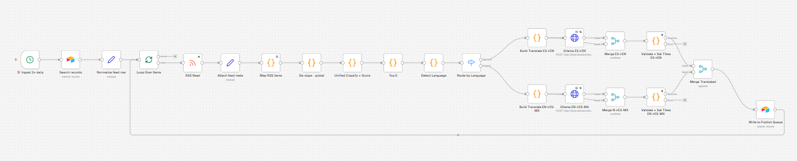
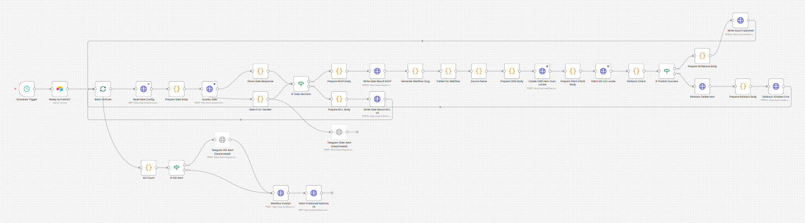
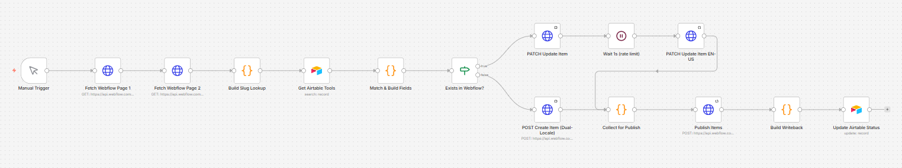
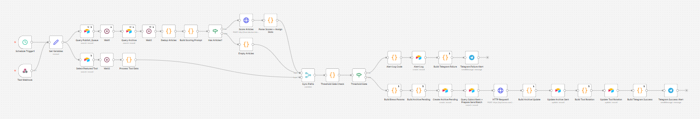

# Hi, I'm Ian Jerde

**AI Systems Builder & Revenue Leader** — 25+ years in technology sales, now designing production-grade AI automation systems. Building Yocoya.ai for LATAM.

I lead a $480M+ ARR business across SMB, system integrators, and retail partners while building end-to-end AI infrastructure through [Yocoya.ai](https://yocoya.ai), a bilingual (ES-MX / EN-US) AI content and tools platform for LATAM.

I don't just sell technology — I build systems that run it.

---

## 🚀 Systems Built

Below are real production workflows powering Yocoya.ai.

---

## 🧠 1. AI Content Ingestion & Translation Engine

> Multi-stage pipeline that ingests, scores, translates, and prepares content for publishing.

### What It Does

- Aggregates content from 150+ RSS sources
- Normalizes and structures incoming data
- Deduplicates content across feeds
- Applies LLM-based classification and scoring
- Detects source language dynamically
- Translates content bidirectionally (ES ↔ EN ↔ ES-MX)
- Prepares structured output for downstream systems

---

## ⚙️ 2. AI Content Publishing Engine

> Automated workflow that validates, routes, and publishes content to CMS.

### What It Does

- Receives validated content from ingestion pipeline
- Applies metadata enrichment and formatting
- Routes content dynamically by category and type
- Publishes to Webflow CMS via API
- Triggers downstream distribution workflows

---

## 🔄 3. AI CMS Sync & Upsert Engine

> Sync engine that updates or creates CMS entries from structured data.

### What It Does

- Fetches existing CMS entries
- Matches records against Airtable dataset
- Determines create vs update logic
- Updates or creates entries via API
- Handles multi-language content (EN / ES-MX)
- Writes back status to Airtable

---

## 📣 4. AI Newsletter & Distribution Engine

> System that selects, formats, and distributes top content automatically.

### What It Does

- Pulls content from publishing queue
- Scores and ranks articles dynamically
- Selects top-performing content
- Builds newsletter-ready content blocks
- Sends via email (Brevo) and Telegram
- Logs results and updates system state

---

## 🧱 Architecture Overview

Core stack powering the system:

- **AI / LLM:** Claude API, prompt pipelines
- **Automation:** n8n (workflow orchestration)
- **Data Layer:** Airtable
- **CMS:** Webflow CMS API
- **Distribution:** Brevo, Telegram
- **Infrastructure:** Cloudflare Workers, APIs
- **Languages:** JavaScript / Node.js, Python, SQL

---

## 📊 System Impact

- Reduced manual content operations by ~80%
- Processes 150+ sources daily
- Fully autonomous publishing + distribution pipeline
- Multi-language content generation at scale
- Modular, API-first architecture

---

## 🎯 What This Demonstrates

- End-to-end AI system design
- Real-world LLM pipeline deployment
- API orchestration across multiple platforms
- Scalable automation architecture
- Ability to turn business problems into working systems

---

## 👋 Connect

- **LinkedIn:** [linkedin.com/in/bigfish](https://www.linkedin.com/in/bigfish/)
- **Email:** dev@yocoya.ai
- **Website:** [yocoya.ai](https://yocoya.ai)
